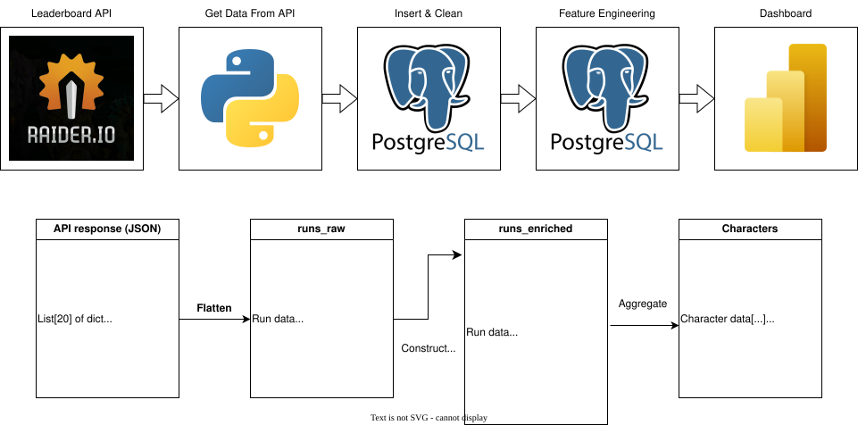

# Project Background and Overview
World of Warcraft, released in 2004, is still one of the biggest video games in the world, boasting millions of active players. A popular game mode is its mythic keystone dungeons, commonly referred to as "Mythic Plus", "Mythic+", or "M+". Players can climb the leaderboard by completing increasingly difficult versions of each dungeon, increasing their rating to earn both in-game rewards and community prestige.

Raider.IO is a third-party website that aggregates this leaderboard data, and gives access to this data through its API. This project collects, processes, and analyzes data from the most recent full season (Season 2 of "The War Within" expansion) to uncover critical insights into the behaviors of successful players.

This project aims to provide insight on the following key areas and questions:

* **Should You Climb Early?** M+ is a team sport, and so you are more successful when you have good teammates. A common piece of advice in the M+ community is that it is easier to climb early in the season, when the best players are still in lower brackets with you. To what degree is this true?
* **Should You Play the Meta?** Players can choose from a wide variety of classes, races, and specs to play as, but the playerbase tends to favor some over others. How much effect on your rating does playing meta have compared to playing off-meta?
* **Should You Play A Different Role?** Tanks and healers are often in high demand. Does playing an in-demand role provide an easier path to success?

This repository includes:

* A Power BI dashboard, available as a [.pbix file](https://github.com/wes-whiting/portfolio/blob/main/raider.io_funnel_analysis/Mythic%2B%20Rating%20Funnel%20Dashboard.pbix). Screenshots of the dashboard will be included throughout this document to support the analysis.

* Python code to [download](https://github.com/wes-whiting/portfolio/blob/main/raider.io_funnel_analysis/get_rio_data.py) the raw Raider.IO data and [insert](https://github.com/wes-whiting/portfolio/blob/main/raider.io_funnel_analysis/process_to_postgres.py) it into a PostgreSQL database . Note that the raw Raider.IO data for a season is several GB, which is much too large to include in Github, and due to API rate limits, gathering this data takes hours regardless of machine or network speed.

* SQL queries to [clean](https://github.com/wes-whiting/portfolio/blob/main/raider.io_funnel_analysis/queries/1_clean_runs_raw.sql) the data, [transform](https://github.com/wes-whiting/portfolio/blob/main/raider.io_funnel_analysis/queries/2_make_tables.sql) it into relevant tables, and finally [compute](https://github.com/wes-whiting/portfolio/blob/main/raider.io_funnel_analysis/queries/3_make_thresholds.sql) the relevant metrics used in the dashboard.

# Data Structure and Pipeline

The raw data from the Raider.IO API comes in JSON format with a complex nested structure and many keys, much of it irrelevant for this project. The raw responses were gathered in Python and stored as a .jsonl file, giving a clean separation between data procurement and data processing. Then, the JSON data was flattened to one row per character per dungeon run, keeping only the relevant attributes: character demographic data and run data.

These rows were inserted into a PostgreSQL database in a table `runs_raw`, cleaned with SQL queries to drop null entries and anonymized characters, and indexed.

For each character, we construct their score history by annotating on each run their running max score for each dungeon, and their running total score, creating a new annotated table `runs_enriched`. The running max columns by dungeon are generated dynamically, so that the query can be reused for a different season with a different set of dungeons.

With the score history reconstructed, data from individual runs was aggregated to determine if and when each character crossed each progression milestone, making a new table `characters`. This last table contains the data used in the final dashboard.

The dashboard centers around a funnel chart showing how many players reach a given rating threshold, and when they reach it on average. The natural thresholds to use are the in-game achievement thresholds, namely "Keystone Explorer" (KSE) for running your first key of the season, "Keystone Conqueror/Master/Hero/Legend" (KSC/KSM/KSH/KSL) for reaching 1500/2000/2500/3000 rating respectively, and the season title for ending the season with a rating in the top 0.1% of all characters. This last threshold is commonly just called "title", and for TWW season 2, the cutoff was 3804.8 rating. Since there is a large gap between KSL and title, we added intermediate thresholds at 3200, 3400, and 3600 rating.

# Executive Summary

# Insights Deep Dive

## Where Are the Bottlenecks?
Looking at the conversion rate from each threshold to the next, we see that thresholds split into two categories: conversion rates of 55% or higher, which we will call easy transitions, and conversion rates of 30% or less, which we will call bottlenecks or hard transitions. In particular, the transition from 1500>2000, 2000>2500, and 3000>3200 appear to be easy, with most characters who reach those tiers also reaching the next. This indicates that not much filtering by skill or difficulty happens at these levels, and a player who reaches 1500 can generally also reach 2000 if they want to.

The other transitions appear to be bottlenecks, namely 0>1500, 2500>3000, 3200>3400, 3400>3600, and 3600>title. This helps validate our use of artificial thresholds between 3000/KSL and title, since getting from eg 3400 to 3600 appears to be about as hard as getting from 2500/KSH to 3000/KSL. The obvious hypothesis is to categorize these bottlenecks as follows:
* 0 to 1500, **The 'never got into it' bracket:** Achieving a rating of 1500 only requires a mix of +3 and +4 keys for all dungeons, barely above the minimum difficulty of +2. In other words, any character that engages significantly with M+ will reach this threshold. Since difficulty is likely not the limiting factor, but the overall conversion rate at this stage is only 29.7%, falling off at this stage likely indicates a lack of interest - many players may dip their toe and run a dungeon or two, but not engage beyond that.
* 2500 to 3000, **The 'just going for weekly vault' bracket:** Achieving a rating of 2500 doesn't require running any dungeons above +10. Since +10 is the level that gives the maximum item reward, players who simply run M+ for gear are likely to stop at this level. Going beyond this level is barely incentivized beyond prestige and simply enjoyment of the game mode, which likely explains why only 28.4% of players continue to 3000.
* 3400, 3600, title, **The difficulty-limited bracket:** Keys at this level offer no direct reward over lower difficulties, so players who get here must be doing it because they just enjoy the game mode and/or the prestige. Each of these stages has dropoff about as harsh as 1500/KSC or 3000/KSL, despite being only 200 rating apart instead of 500. These levels are where difficulty likely becomes a major limiting factor - not only in the actual skill required to play the content, but also in time commitment to continue pushing keys and social connections to find consistent groups.

It is interesting that the 3000 to 3200 transition does *not* appear to be a bottleneck, with 62.3% conversion, even though 3000 rating brings some minor rewards and 3200 does not. This suggests that, for many of the players who reach 3000/KSL, they are already climbing just for fun, and are only stopped by eventually hitting their difficulty ceiling rather than by running out of available rewards.

## Climbing Early

## Spec and Role

## Race and Faction

# Recommendations

Recall that we originally posed three questions, so let's summarize what the data says about them.

* **Should You Climb Early?**
* **Should You Play the Meta?**
* **Should You Play A Different Role?**

# Limitations & Assumptions
First, this is strictly observational data. Although we can see which practices more successful players have, it is risky to conclude that they are successful because of those practices. For example, out of the 21 paladins who made title, 12 were dwarves and only 2 were human. Is that because dwarves really are 6x better, or is it because the kind of player who is dedicated enough to push for title is also dedicated enough to buy a race change for even a marginal benefit? So we should be careful about drawing strong conclusions that a certain practice is very beneficial, when instead the causation might run the other way.

Second, although the dataset is large, it is not complete. Our data was obtained from the raider.io API, and due to limitations of that API, we do not  have access to the entire recorded leaderboard, only the first 1000 pages of runs per dungeon-affix combination (at 20 runs per page), and many of these categories have over 1000 pages. In total, our dataset includes 1.4 million runs and 955 thousand players, while the full US leaderboard includes 8.7 millions runs and 1.05 million players.

The good news is that, since we have the first 1000 pages of runs sorted by score, the missing runs are strictly at lower brackets. For example, the first 1000 pages of the Darkflame Cleft leaderboard includes every single +15 or higher key (for reference, completing all dungeons at +15 corresponds to a rating of 3280). Conclusions about the highest brackets (3200 and above) should be robust.

Lastly, we cannot reliably track characters who have been transferred or renamed. Any character who was transferred or renamed mid-season will show up in our data as two different characters, or more if they were transferred multiple times, with ratings calculated separately. This pollutes the data with multiple incomplete characters that should be just one. However, since transfers and renames are relatively infrequent, this effect should be minor. Similarly, characters who were anonymized (eg, due to inappropriate names that violate the ToS) have been excluded from the data entirely; again, this is rare and the effect is minor.
